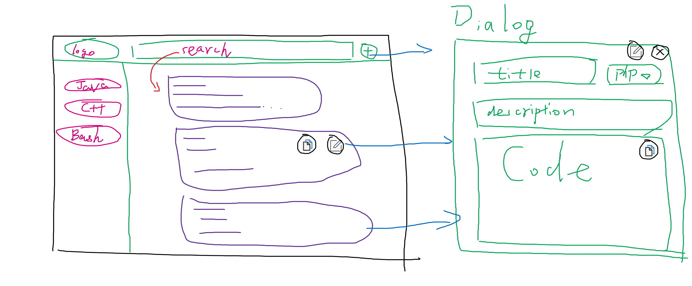

- [速查表项目文档](#速查表项目文档)
  - [功能需求](#功能需求)
  - [数据结构设计](#数据结构设计)
  - [UI设计](#ui设计)
  - [接口说明](#接口说明)

# 速查表项目文档

旨在创建一个快速查询常用命令、代码段(以下简称代码段)及其功能描述的网站，用户可以可以通过描述中的字段检索代码段，添加未收录的代码段或编辑已有代码段的功能描述。

## 功能需求

代码段增编改查功能
- 添加代码段
- 编辑代码段
- 搜索代码段

后期可选功能
- 多用户
- 点赞 - 未登录用户点赞仅展示效果
- 标记代码段 - 过时/不可用

## 数据结构设计

使用如下`CodeSegment`结构表示常用命令或代码段，其中`title`和`desc`共同表明该命令/代码段的功能，允许只使用其中一个字段表示命令/代码段，但不能同时为空。例如对于简单的Linux命令，可仅使用`title`字段阐述其功能，而对于较为复杂的代码则使用`title`简述功能并在`desc`中详细说明。

存储方面，采用 **MySQL + Elasticsearch** 的方式，数据既存储在MySQL中，也发送到Elasticsearch实现全文搜索。

搜索方面，`title`, `desc`, `code`三个字段支持全文搜索。

```
CodeSegment {
    id          -  string  -  唯一UUID标识
    title       -  string  -  标题，对功能的简短描述
    desc        -  string  -  对功能的详细描述
    code        -  string  -  命令或代码的内容
    language    -  enum    -  Command(表示可执行命令)或编程语言类型如C++, Java
    createAt    -  int64   -  创建时间，Unix时间戳，毫秒，如1603091738197
    lastModify  -  int64   -  最后修改时间，Unix时间戳，毫秒，如1603091738197
}
```
示例
```
{
    id:         ea98f819-0dde-4e25-a6a2-17314cc27f1c
    title:      Linux创建空文件
    desc:
    code:       touch a.txt
    language:   Command
    createAt:   1603092591383
    lastModify: 1603092601384
}
{
    id:         0acef890-cdd4-4eb6-acc7-40a5367be124
    title:      Java日期格式化
    desc:       使用SimpleDateFormat类格式化当前日期并打印，
                日期格式为xxxx年xx月xx日星期x xx点xx分xx秒
    code:   
                Date now = new Date(); // 创建一个Date对象，获取当前时间
                SimpleDateFormat f = new SimpleDateFormat("yyyy年MM月dd日 HH点mm分ss秒");
                System.out.println(f.format(now)); // 将当前时间袼式化为指定的格式
    language:   Java
    createAt:   1603092410351
    lastModify: 1603092450384
}
```

## UI设计

数据呈现方面
- 使用**列表**形式列出所有代码段
- 使用**卡片**展示代码段的缩略内容，包括标题、描述、代码内容、语言类型。
- 使用**对话框**展示代码段完整内容，并作为编辑对话框。
  - 仅呈现数据时，对话框展示的内容不可编辑

内容管理方面
- 搜索实时更改呈现数据的列表，键入数据短暂停顿(200ms)后立即发送请求
- 卡片及对话框都提供快捷复制代码的功能
- 对话框提供编辑按钮，可以由不可编辑变为可编辑
- 完整代码展示时应提供行号、语法高亮功能

下图为UI设计

如图



## 接口说明

前后端分离，后端提供静态文件及Rest接口，接口说明如下

- `/index`，`GET`，首页文件

- `/codeSegment/all?language=xx&pageCount=xx&pageSize=xx`，`GET`，参数格式`language=xx`，无参数时获取所有代码段数据，有参数时，根据`language`参数值返回某种语言的代码段，根据`pageCount`和`pageSize`获取某一页的数据 如`/codeSegment/all?language=Java*&pageCount=1&pageSize=10`返回Java语言的前十个代码段，返回值为JSON数组。响应体示例如下

  ```json
  [
    {
        "id": "ea98f819-0dde-4e25-a6a2-17314cc27f1c",
        "title": "Linux创建空文件",
        "desc": "",
        "code": "touch a.txt",
        "language": "Command",
        "createAt": 1603092591383,
        "lastModify": 1603092601384
    }
  ]
  ```
- `/codeSegment/update`，`POST`，更新某个代码段，请求体为更新后的JSON数据，响应体忽略，服务端处理请求时需更新数据`lastModify`字段的值。请求体示例:

  ```json
  {
    "id": "ea98f819-0dde-4e25-a6a2-17314cc27f1c",
    "title": "Linux创建空文件",
    "desc": "创建不包含任何内容的空文件，echo > a.txt有相同功能",
    "code": "touch a.txt",
    "language": "Command",
    "createAt": 1603092591383,
    "lastModify": "由有服务器更新该值"
  }
  ```
- `/codeSegment/allLanguages`，`GET`，获取已有代码段的所有语言类型，返回值为JSON数组：
  ```json
  [
      "Java",
      "C++",
      "Bash",
      ...
  ]
  ```

